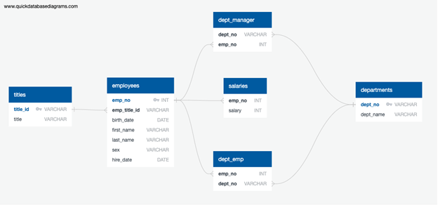

## Employee Analysis of Pewlett Hackard

Employee analysis of Pewlett Hackard has been conducted in three phases:
*Data Modelling
*Data Engineering 
*Data Analysis

Data from the company has six different related tables. 

### Data Modelling

On Data Modelling phase, QuickDBD (https://www.quickdatabasediagrams.com/) was used to sketch the Entity Relationship Diagram (ERD) of the tables OF Pewlett Hackard`s data.



### Data Engineering

Then, on data engineering phase, the table schema for each of the six CSV files was created. While creating table schema, primary keys, foreign keys, type of the data and other constraints were specified.

After creating tables, data from csv file was imported to corresponding table, using Postgresql`s import/export function. 

### Data Analysis

Lastly, on data analysis part, codes were written in PgAdmin to answer below questions.

1. List the employee number, last name, first name, sex, and salary of each employee.

```
SELECT e.emp_no, e.last_name, e.first_name, e.sex, s.salary
FROM employees as e
INNER JOIN salaries as s ON
e.emp_no=s.emp_no;
```

2. List the first name, last name, and hire date for the employees who were hired in 1986.

3. List the manager of each department along with their department number, department name, employee number, last name, and first name.

4. List the department number for each employee along with that employee’s employee number, last name, first name, and department name.

5. List first name, last name, and sex of each employee whose first name is Hercules and whose last name begins with the letter B.

6. List each employee in the Sales department, including their employee number, last name, and first name.

7. List each employee in the Sales and Development departments, including their employee number, last name, first name, and department name.

8. List the frequency counts, in descending order, of all the employee last names (that is, how many employees share each last name).